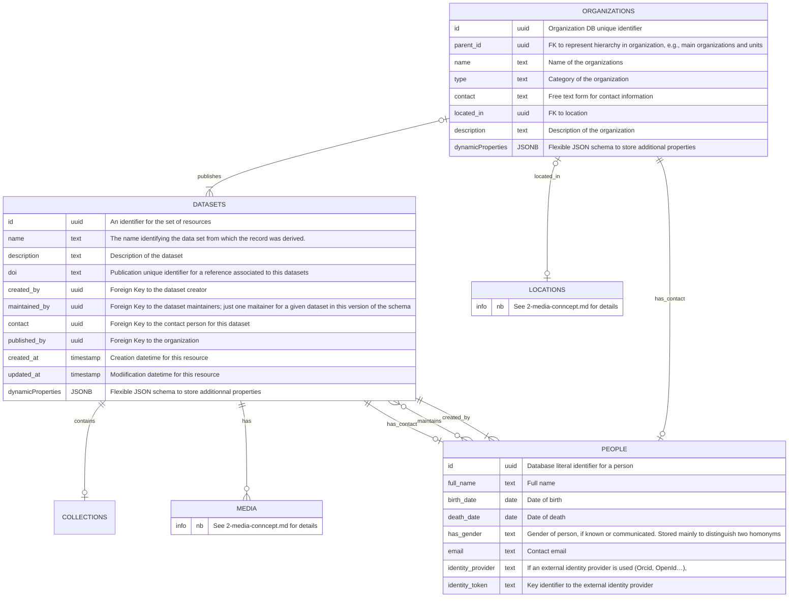

# 1. L'organisation en `datasets`

## Présentation sommaire

Nous proposons d'organiser l'ensemble des sons et de leur media dérivés (e.g spectrogramme) au sein de **jeux de données** (_datasets_). Les _datasets_ forme un ensemble cohérent de ressources produites et collectés dans un but précis et dans un contexte donné (protocole d'échantillonnage, campagne scientifique, projet de recherche, études d'impact...)

Éléments central d'organisation des données, les _datasets_ peuvent et doivent être lié à des institutions et/ou des organisations. Ces jeux de donnnés ont été créé (_owned_) et peuvent être maintenus (_maintained_) par une ou plusieurs personnes, parfois appelés agent-e-s ou contributeur-rices. Une personne référennte peut également être désigné comme contact.

Il est courant qu'un jeu de données soit associé à une publication via le concept de `Reference`. Nous détaillerons pas ce type de relation dans le schéma actuel mais nous laissons la possibilités aux contributeurs de la base de données d'associé un DOI à chaque _datasets_ créé en base de données

Enfin, les _datasets_ peuvent également être associés à une collection biologique. Du fait de la simplification de notre schéma, les jeux de données peuvet être syonymes de collections.
Toujours dans une perspective de simplification, nous n'avons pas introduit d'organisation hiérarchqiue des jeux de données. En effet, le concept de `Dataset` est [progressivement abandonné](https://dwc.tdwg.org/list/#dwc_Dataset), au profit d'un nouveau standard [ABCD (Access to Biological Collection Data)](https://www.tdwg.org/standards/abcd/). Une intégration de ce standard et de ses concepts associés dans le présent schéma nécessiterait un enrichissement notable de la première ébauche présenté ici.

## Modèle conceptuel de données des classes voisines des `Datasets`

