# 2. Le concept de media

## Présentation générale

Nous avons pris les parti de structurer la base de données afin que puisse y être intégré tout type de **média audiovisuels**.

Ayant conscience que le présent travail s'inscrit dans le périmètre de gestion d'une _sonothèque_, la spécificité des **sons d'origine biologique** sera traité avec la plus grance attention.

Ainsi, nous proposons d'organiser le concept **Media**, à l'instar du concept **Taxon**, comme arbre hiérarchique à travers une auto-relation (_self-relationship_). Ce choix nous permettra de décrire les relations entre les **media sources** et les **media dérivés**.

Ces médias peuvent être de nature homogène (e.g un nouveau fichier so issu d'un post traitement audio d'un fichier son source) mais également de **nature hétérogène** (e.g un fichier son extrait d'une capture vidéo, une image telle qu'un spectrogramme dérivé d'un fichier son). De fait, il nous a semblé opportun d'opter pour une structure de base de données permettant une gestion générique de fichier multimedia.

Certains paradigme de conception (_design patterns_), comme par exemple le _single table inheritance_, permettent à partir d'une seule table au sein d'une base de données relationelle de construire un ensemble de sous-classes (e.g Son, Image, Video...) partageant une logique commune mais exposant certains comportements spécifiques. L'usage de l'attribut `type` pourra nnous permettre de cartographier ces sous-classes associées.

Par ailleurs, chaque media peut (et, dans l'idéal, devrait) être associé à un **événement d'échantillonnage** (_sampling event_), lui-même caractérisé par une unité de temps, de lieu et de protocole d'échantillonnage et/ou d'acquisition de données. Les données qualifiant les unités de temps et de protocoles seront détaillées au sein de la table `sampling_events`. L'unité de lieu sera quant à elle persistée au sein d'une table dédiée `locations` contenant les informations de géographique (position, géométrie et toponymies) ainsi que des informations complémentaires de contexte écologique, climatique ou géomorphologique.

Enfin, les metadonnées associées au fichier media en tant que tel seront décrite dans une table dédiée `media_files`; une alternative aurait été de stocker ces données au sein d'un schéma flexible `JSONB` au sein de la table `media`

## Modèle conceptuel de données des concepts voisins de la classe Media

```mermaid
erDiagram
    MEDIA {
        id uuid "Media identifier See: http://purl.org/dc/terms/identifier"
        parent_id uuid "Parent media identifier"
        code text "A free-form identifier (a simple number, an alphanumeric code, a URL, etc.) for the resource that is unique and meaningful primarily for the data provider. See: http://rs.tdwg.org/ac/terms/providerManagedID"
        title text "Concise title, name, or brief descriptive label of institution, resource collection, or individual resource. This field SHOULD include the complete title with all the subtitles, if any. See: http://purl.org/dc/terms/title"
        type text "Type of media: Still Image, MovingImage, Sound See: http://purl.org/dc/terms/identifier"
        subtype text "Subtype of media, e.g Species Sound, Soundscape, Song… (ideally should be linked to a Vocabulary terms should have an. IRI)"
        title text "Media title"
        description text "An account of the resource. See: http://purl.org/dc/terms/description"
        tags text[] "Media tags Tags may be multi-worded phrases. See: http://rs.tdwg.org/ac/terms/tag"
        comment text "Any comment provided on the media resource, as free-form text."
        resource_creation_technique text "Information about technical aspects of the creation and digitization process of the resource. This includes modification steps ('retouching') after the initial resource capture. See: http://rs.tdwg.org/ac/terms/resourceCreationTechnique"
        available range(timestamp) "Date (often a range) that the resource became or will become available."
        created_at timestamp "Timestamp of ressource creation in database"
        updated_at timestamp "Timestamp of ressource update in database See: http://purl.org/dc/terms/modified"
        recorded_at timestamp "Timestamp of ressource recording  The date and time MUST comply with the World Wide Web Consortium (W3C) datetime practice, https://www.w3.org/TR/NOTE-datetime See: http://ns.adobe.com/xap/1.0/CreateDate"
        recording_range range(timestamp) "Recording timestamp exact temporal coverage"
        temporal text "Temporal coverage of the ressource See: http://purl.org/dc/terms/temporal"
        time_of_day text "Free text information beyond exact clock times. See: http://rs.tdwg.org/ac/terms/timeOfDay"
        rating integer "A user-assigned rating for the ressource. The value shall be -1 or in the range [0..5], where -1 indicates 'rejected' and 0 indicates 'unrated'. If xmp:Rating is not present, a value of 0 should be assumed. See: http://ns.adobe.com/xap/1.0/Rating"
        naturality_rating integer "A user-assigned rating for perceived naturality. The value shall be -1 or in the range [0..5], where -1 indicates 'rejected' and 0 indicates 'unrated'. If xmp:Rating is not present, a value of 0 should be assumed. See: http://ns.adobe.com/xap/1.0/Rating"
        musicality_rating integer "A user-assigned rating for musical quality. The value shall be -1 or in the range [0..5], where -1 indicates 'rejected' and 0 indicates 'unrated'. If xmp:Rating is not present, a value of 0 should be assumed. See: http://ns.adobe.com/xap/1.0/Rating"
        media_propagation text "Location remarks"
        ecological_tags array(text) "Tags, eventually multi words, describing ecological an/or surrounding context ('audible river', 'biophonia',….)"
    }
    SAMPLING_EVENTS {
        id	uuid	"An identifier for the set of information associated with a dwc:Event (something that occurs at a place and time). May be a global unique identifier or an identifier specific to the data set."
        parent_id	uuid	"An identifier for the broader dwc:Event that groups this and potentially other dwc:Events.	http://rs.tdwg.org/dwc/terms/parentEventID"
        basis_of_record	text[]	"Type of record collected in the sampling event:; wether Human Observation or Machine Observation"
        type	text	"The nature of the dwc:Event. Recommended best practice is to use a controlled vocabulary.	http://rs.tdwg.org/dwc/terms/eventType"
        sampling_protocol	text	"The names of, references to, or descriptions of the methods or protocols used during a dwc:Event.	http://rs.tdwg.org/dwc/terms/samplingProtocol"
        started_at	timestamp	"The date-time or interval during which a dwc:Event occurred	http://rs.tdwg.org/dwc/terms/eventDate"
        ended_at	timestamp	"The date-time or interval during which a dwc:Event occurred	http://rs.tdwg.org/dwc/terms/eventDate"
        date_range	range(timestamp)	"The date-time or interval during which a dwc:Event occurred	http://rs.tdwg.org/dwc/terms/eventDate"
        habitat	text	"A category or description of the habitat in which the dwc:Event occurred.	http://rs.tdwg.org/dwc/terms/habitat"
        notes	text	"Comments or notes about the dwc:Event. ABCD Equivalence: DataSets/DataSet/Units/Unit/Gathering/Notes	http://rs.tdwg.org/dwc/terms/eventRemarks"
        measurments_or_facts	JSONB	"A list (concatenated and separated) of additional measurements or characteristics of the Event.	http://rs.tdwg.org/dwc/terms/eventAttributes"
        created_at	timestamp
        updated_at	timestamp
    }
    LOCATIONS {
        id 	uuid
        parent_id	uuid
        higher_geography_path	ltree	"A list (concatenated and separated) of geographic names less specific than the information captured in the dwc:locality term."
        geom	geometry	"Spatial geometry representing a given locations as WKB; contains SRID (default 4326) information; could be Point, Line, Polygon, Polygon with hole or Features Collections"
        geometry_precision	float	"A decimal representation of the precision of the coordinates given in the dwc:decimalLatitude and dwc:decimalLongitude."
        identifier	text	"Unique text identifier for the given location; used in ltree path (hierarchical tree-like data type)"
        country	text	"The name of the country or major administrative unit in which the dcterms:Location occurs."
        state_province	text	"The name of the next smaller administrative region than country (state, province, canton, department, region, etc.) in which the dcterms:Location occurs."
        municipality	text	"The full, unabbreviated name of the next smaller administrative region than county (city, municipality, etc.) in which the dcterms:Location occurs. Do not use this term for a nearby named place that does not contain the actual dcterms:Location."
        locality	text	"The specific description of the place."
        depth_min	float	"The lesser depth of a range of depth below the local surface, in meters."
        elevation_max	float	"The upper limit of the range of elevation (altitude, usually above sea level), in meters."
        sampling_remarks	JSONB	"Comments or notes about the sampling location. Contains meteorological context in a structured (JSON Schema should be refined)"
        remarks	text	"Comments or notes about the dcterms:Location."
        provided_id	text	"External id returned from an external service access point (eg: gdam.org)"
        provider_source	text	"External service access point souce url"
    }
    MEDIA_FILES {
        id	uuid
        storage_url	text	"URL access point to the media"
        mime_type_format	text	"Mimetype format of the file. See: http://purl.org/dc/elements/1.1/format"
        freq_low	float	"The lowest frequency of the phenomena reflected in the multimedia item. Numeric value in hertz (Hz). See: http://rs.tdwg.org/ac/terms/freqLow"
        freq_high	float	"The highest frequency of the phenomena reflected in the multimedia item. Numeric value in hertz (Hz). See: http://rs.tdwg.org/ac/terms/freqHigh"
        sample_rate	float	"Associates a digital signal to its sample rate. Numeric value in hertz (Hz). See: http://purl.org/ontology/mo/sample_rate"
        duration	integer	"Duration of the media in seconds"
        size	integer	"Size of the media in bytes"
        pixel_x_dimension	integer
        pixel_y_dimension	integer
        creation_technique	text	"Information about technical aspects of the creation and digitization process of the resource. This includes modification steps ('retouching') after the initial resource capture. See: http://rs.tdwg.org/ac/terms/resourceCreationTechnique"
        rights	text	"Information about rights held in and over the resource. See: http://purl.org/dc/elements/1.1/rights"
        attribution_url	text	"The URL where information about ownership, attribution, etc. of the resource may be found. See: http://rs.tdwg.org/ac/terms/attributionLinkURL"
        usage_terms	text	"A collection of text instructions on how a resource can be legally used, given in a variety of languages. See: https://ac.tdwg.org/termlist/#xmpRights_UsageTerms"
        cv_terms	array(text)	"A term to describe the content of the image by a value from a Controlled Vocabulary. See: https://ac.tdwg.org/termlist/#Iptc4xmpExt_CVterm"
        dynamic_metadata	JSONB	"Any information that could be gathered from original file (XMP, IPTC, WAV header)"
        associated_media	uuid
        owned_by	uuid
        owner_litteral	text	"Legal owner of the resource."
        created_at	timestamp
        updated_at	timestamp
    }
    DEVICES {
        id	uuid
        brand	text	"Brand of the capture device"
        model	text	"Model of the capture device"
        firmware_version	text	"Version of the firmware installed on the device during recording"
        type	text	"Type of the capture device; e.g Recorder, Microphone, Camera, Camera trap"
    }

    SAMPLING_EVENTS ||--o{ MEDIA : sampled_in
    LOCATIONS ||--o{ SAMPLING_EVENTS : sampled_in
    MEDIA_FILES ||--|| MEDIA : associated_file
    MEDIA_FILES ||--o{ DEVICES : associated_file
    PEOPLE |o--|| MEDIA : created_by
    PEOPLE |o--|| MEDIA : updated_by
    PEOPLE |o--|| MEDIA : recorded_by

```

## Description détaillée des tables

> 📝 _En cours de rédaction_
