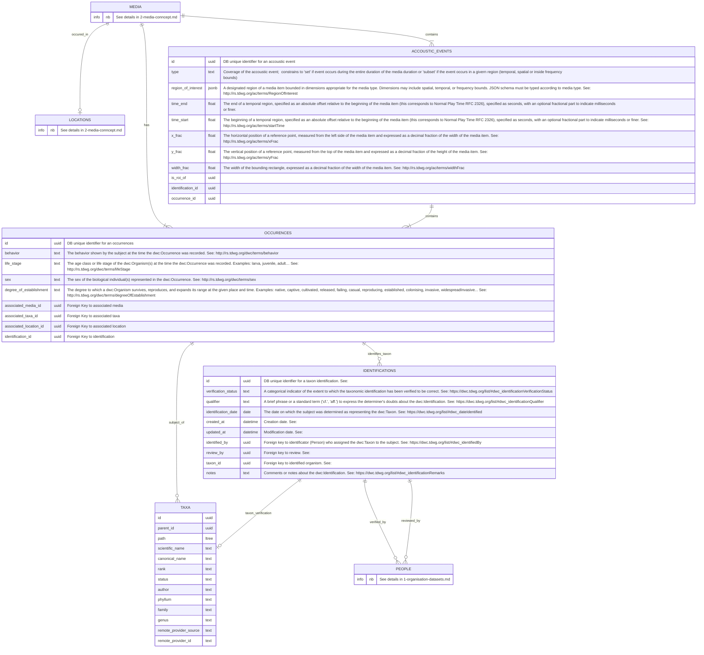

# 3. Événements acoustiques et occurences d'espèces

## Présentation sommaire

Chaque média (Son, Vidéo ou Image) peut témoigner de la **présence d'un ou plusieurs sujets biologiques**. Afin de renseigner le présence de ces sujets, nous propons d'introduire au sein du système de gestion le concept d'occurences `Occurence` complété par le concept d'évenements acoustiques `AccousticEvent`.

Les [occurences](https://dwc.tdwg.org/list/#dwc_Occurrence) marque l'existence d'un organisme biologique dans un périmètre spatial et temporel défini. Dans le cadre de notre système de gestion, un média donné pour contenir aucune, une seule (_species sounds_) voir plusieurs occurences (_soundscape_). Par principe, la table d'occurence relie un media à un ou plusieurs taxa. Nous proposons que ce concept de liaison apporte des informations complémentaires sur la localisation (cette dernère pouvant être récupérés des classes liées comme la localisation du média ou de l'événement d'échantillonnage)

## Modèle conceptuel des données pour les classes concernées

## Description détaillées des tables

### Accoustic Events

| Field              | Type  | Description                                                                                                                                                                                                                                                                                           |
| ------------------ | ----- | ----------------------------------------------------------------------------------------------------------------------------------------------------------------------------------------------------------------------------------------------------------------------------------------------------- |
| id                 | uuid  | DB unique identifier for an accoustic event                                                                                                                                                                                                                                                           |
| type               | text  | Coverage of the accoustic event; constrains to 'set' if event occurs during the entire duration of the media duration or 'subset' if the event occurs in a given region (temporal, spatial or inside frequency bounds)                                                                                |
| region_of_interest | jsonb | A designated region of a media item bounded in dimensions appropriate for the media type. Dimensions may include spatial, temporal, or frequency bounds. JSON schema must be typed according to media type. See: http://rs.tdwg.org/ac/terms/RegionOfInterest                                         |
| time_end           | float | The end of a temporal region, specified as an absolute offset relative to the beginning of the media item (this corresponds to Normal Play Time RFC 2326), specified as seconds, with an optional fractional part to indicate milliseconds or finer.                                                  |
| time_start         | float | The beginning of a temporal region, specified as an absolute offset relative to the beginning of the media item (this corresponds to Normal Play Time RFC 2326), specified as seconds, with an optional fractional part to indicate milliseconds or finer. See: http://rs.tdwg.org/ac/terms/startTime |
| x_frac             | float | The horizontal position of a reference point, measured from the left side of the media item and expressed as a decimal fraction of the width of the media item. See: http://rs.tdwg.org/ac/terms/xFrac                                                                                                |
| y_frac             | float | The vertical position of a reference point, measured from the top of the media item and expressed as a decimal fraction of the height of the media item. See: http://rs.tdwg.org/ac/terms/yFrac                                                                                                       |
| width_frac         | float | The width of the bounding rectangle, expressed as a decimal fraction of the width of the media item. See: http://rs.tdwg.org/ac/terms/widthFrac                                                                                                                                                       |
| is_roi_of          | uuid  |                                                                                                                                                                                                                                                                                                       |
| identification_id  | uuid  |                                                                                                                                                                                                                                                                                                       |
| occurrence_id      | uuid  |                                                                                                                                                                                                                                                                                                       |

### Occurences

| Field                   | Type | Description                                                                                                                                                                                                                                                                                                 |
| ----------------------- | ---- | ----------------------------------------------------------------------------------------------------------------------------------------------------------------------------------------------------------------------------------------------------------------------------------------------------------- |
| id                      | uuid | DB unique identifier for an occurrences                                                                                                                                                                                                                                                                     |
| behavior                | text | The behavior shown by the subject at the time the dwc:Occurrence was recorded. See: http://rs.tdwg.org/dwc/terms/behavior                                                                                                                                                                                   |
| life_stage              | text | The age class or life stage of the dwc:Organism(s) at the time the dwc:Occurrence was recorded. Examples: larva, juvenile, adult… See: http://rs.tdwg.org/dwc/terms/lifeStage                                                                                                                               |
| sex                     | text | The sex of the biological individual(s) represented in the dwc:Occurrence. See: http://rs.tdwg.org/dwc/terms/sex                                                                                                                                                                                            |
| degree_of_establishment | text | The degree to which a dwc:Organism survives, reproduces, and expands its range at the given place and time. Examples: native, captive, cultivated, released, failing, casual, reproducing, established, colonising, invasive, widespreadInvasive... See: http://rs.tdwg.org/dwc/terms/degreeOfEstablishment |
| associated_media_id     | uuid | Foreign Key to associated media                                                                                                                                                                                                                                                                             |
| associated_taxa_id      | uuid | Foreign Key to associated taxa                                                                                                                                                                                                                                                                              |
| associated_location_id  | uuid | Foreign Key to associated location                                                                                                                                                                                                                                                                          |
| identification_id       | uuid | Foreign Key to identification                                                                                                                                                                                                                                                                               |
